<div align="center">

<a href="https://getnorte.dev">
  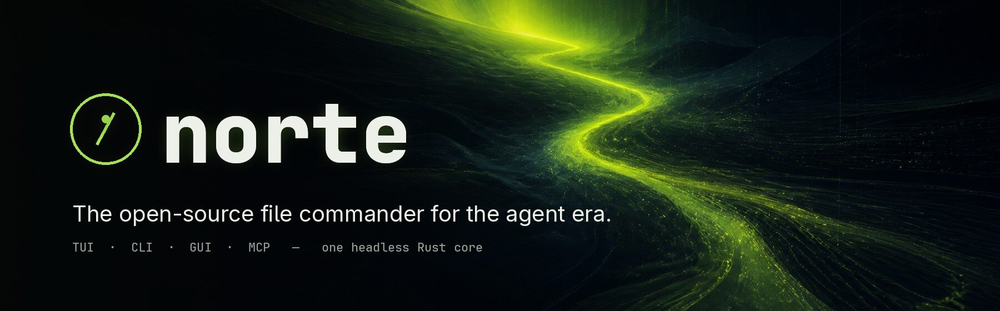
</a>

<br>

[](CHANGELOG.md)
[](#license)
[](rust-toolchain.toml)
[](#install)
[](#agents-governed-not-trusted)
[](#telemetry)

**[Website](https://getnorte.dev)** ·
**[Install](#install)** ·
**[Docs](docs/README.md)** ·
**[Plugins](#plugins)** ·
**[Architecture](ARCHITECTURE.md)** ·
**[Changelog](CHANGELOG.md)** ·
**[Contributing](CONTRIBUTING.md)**

</div>

<br>

**norte** is a two-pane, orthodox file manager built for how people work now:
a person at the keyboard, and an AI agent that also needs to touch files.
One headless Rust core does the work. The terminal UI, the window, the CLI and
the agent all talk to it through the same protocol, and **everything an agent
does passes through policy, is journaled, and can be undone.**

<div align="center">
  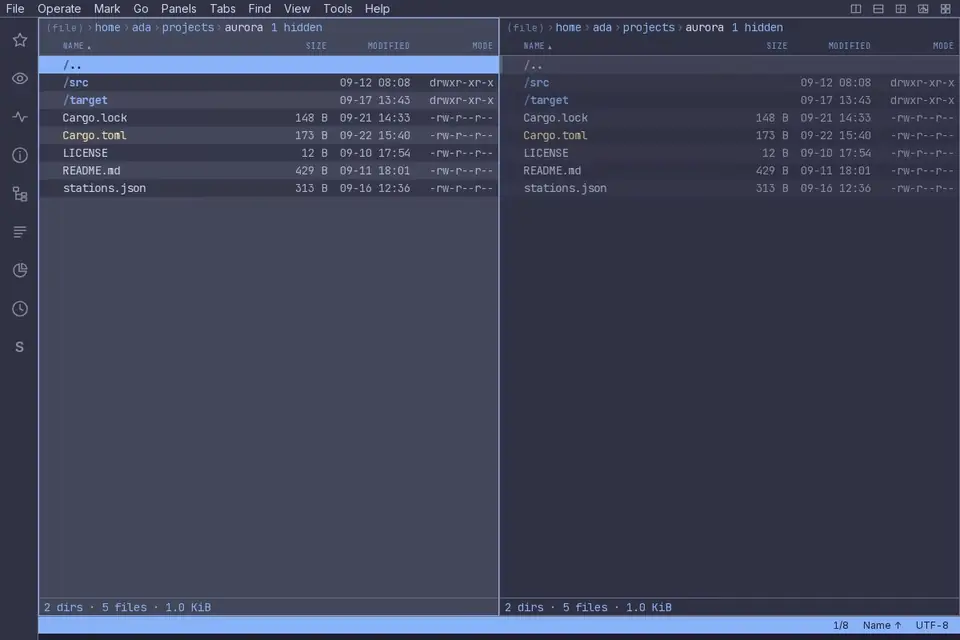
  <br>
  <sub><i>norte-gui, recorded by a script from the current build. Nothing on this page is a mockup.</i></sub>
</div>

<br>

## Why norte

<table>
<tr>
<td width="50%" valign="top">

### ⌨️ Orthodox, and fast
Two panes: one is where you are, the other is where things go. F-keys,
a menu bar, a command palette and **seven keymap presets** —
`orthodox`, `vim`, `cua`, `krusader`, `far`, `norton` and `total-commander`.
Your muscle memory already works.

</td>
<td width="50%" valign="top">

### 🧭 One core, every surface
A headless core with a stable, versioned protocol. `ntc` in any terminal,
`norte-gui` as a native window, `norte` on the command line — all
interchangeable clients of the same engine, same journal, same undo.

</td>
</tr>
<tr>
<td width="50%" valign="top">

### 🤖 Agents, governed
`norte mcp serve` lets Claude Code, Codex or any MCP client work on your
files — inside a scope **you** grant, under rules **you** write, with
every change journaled and `norte undo` one command away.

</td>
<td width="50%" valign="top">

### 🔒 Yours, and only yours
No telemetry, not even opt-in. WASM plugins run sandboxed and ask for each
capability. Remote hosts are pinned on first use. The journal is
hash-chained and auditable.

</td>
</tr>
</table>

## Features

<table>
<tr>
<td width="50%" valign="top">
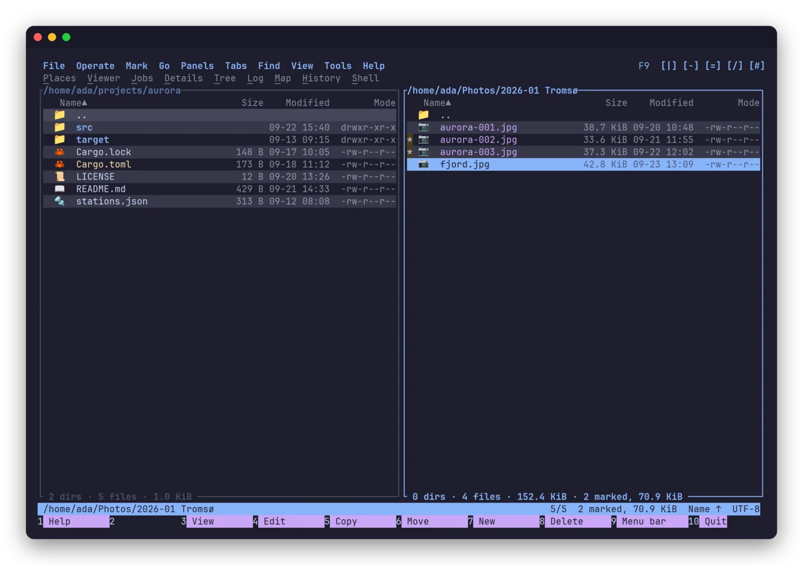
<p><b>Two panes, one destination.</b> Mark files, see the totals, send
them across. Local disks, SFTP, FTP, S3 and ZIP/TAR/RAR archives all open
as plain directories through one virtual filesystem.</p>
</td>
<td width="50%" valign="top">
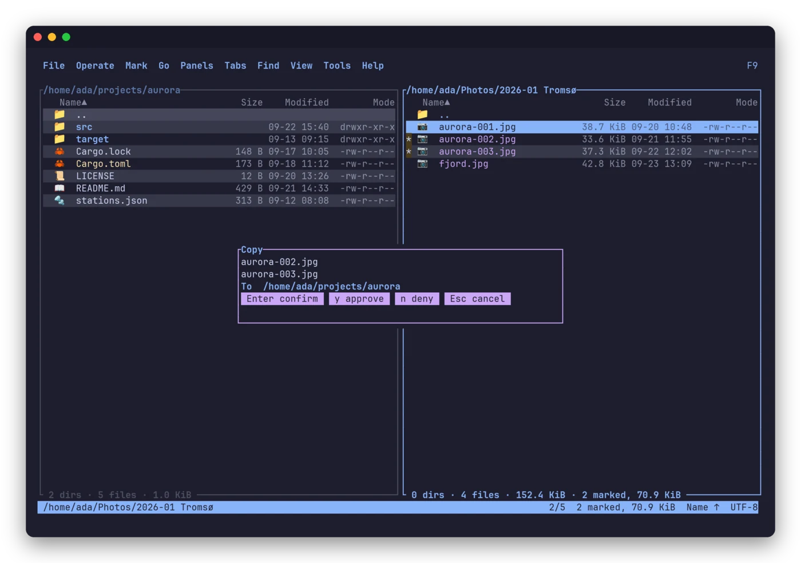
<p><b>Copies are tasks; you keep working.</b> Queued, resumable,
cancelable with <code>Ctrl-C</code> without leaving half-files behind.
Deletes go to the trash.</p>
</td>
</tr>
<tr>
<td width="50%" valign="top">
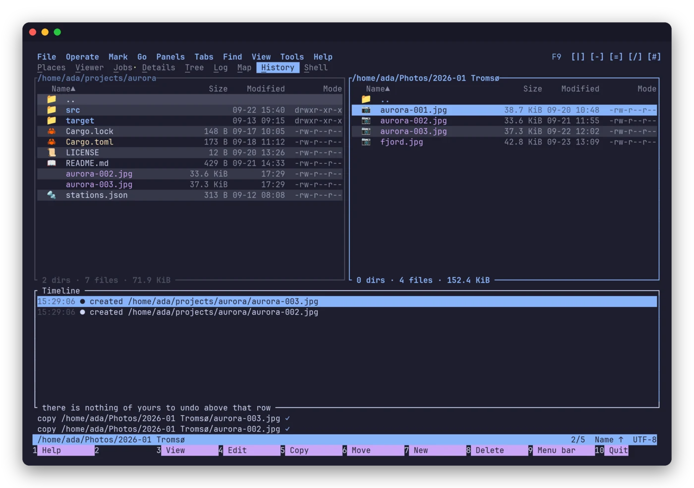
<p><b>Everything that changed, and a way back.</b> Every operation — yours,
an agent's, a plugin's — lands in a journal you can browse and undo.</p>
</td>
<td width="50%" valign="top">
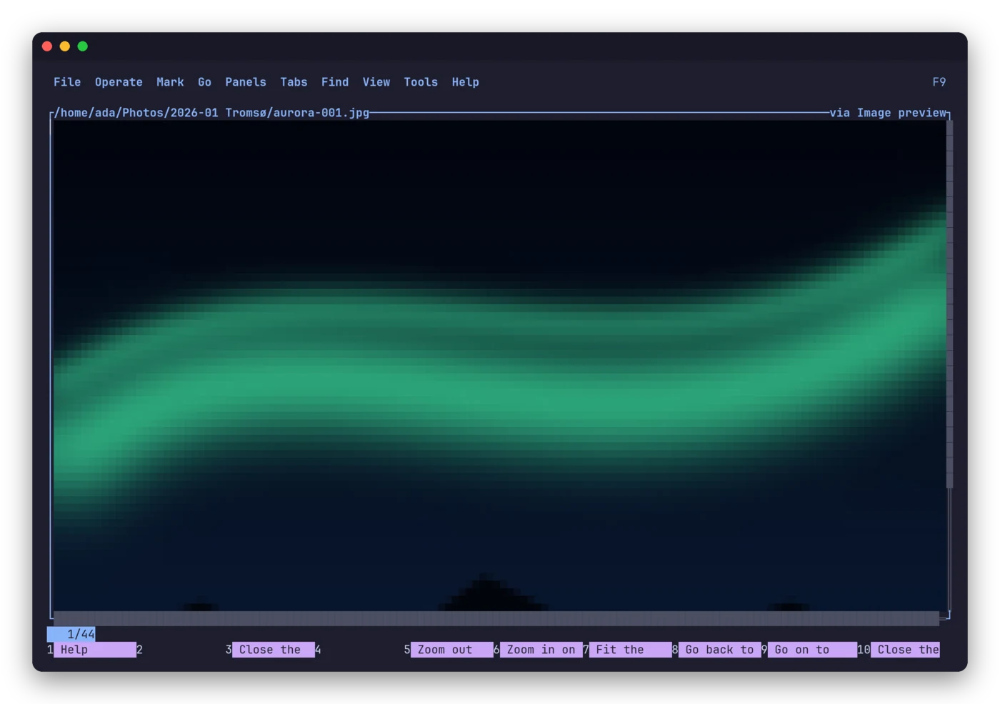
<p><b>An image is shown as an image.</b> Even in a terminal. Markdown is
rendered, code is highlighted, and every previewer is a sandboxed plugin
that never sees more than the one file it renders.</p>
</td>
</tr>
<tr>
<td width="50%" valign="top">
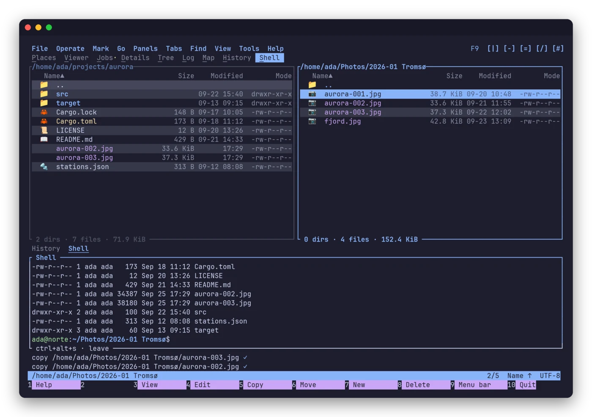
<p><b>A shell inside a panel.</b> <code>Ctrl+Alt+S</code> opens a terminal
below the listings, in the focused pane's directory, next to your files.</p>
</td>
<td width="50%" valign="top">
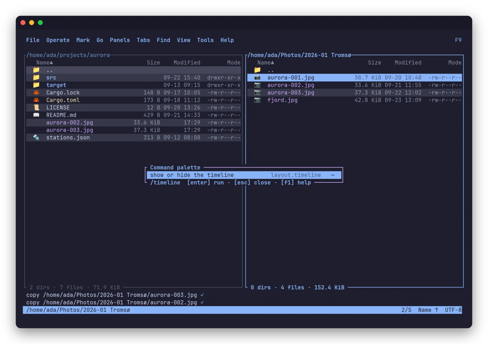
<p><b>Every command, one keystroke away.</b> The palette, the F9 menus and
the help list all of them, each with the key <i>your</i> preset gives it.</p>
</td>
</tr>
<tr>
<td width="50%" valign="top">
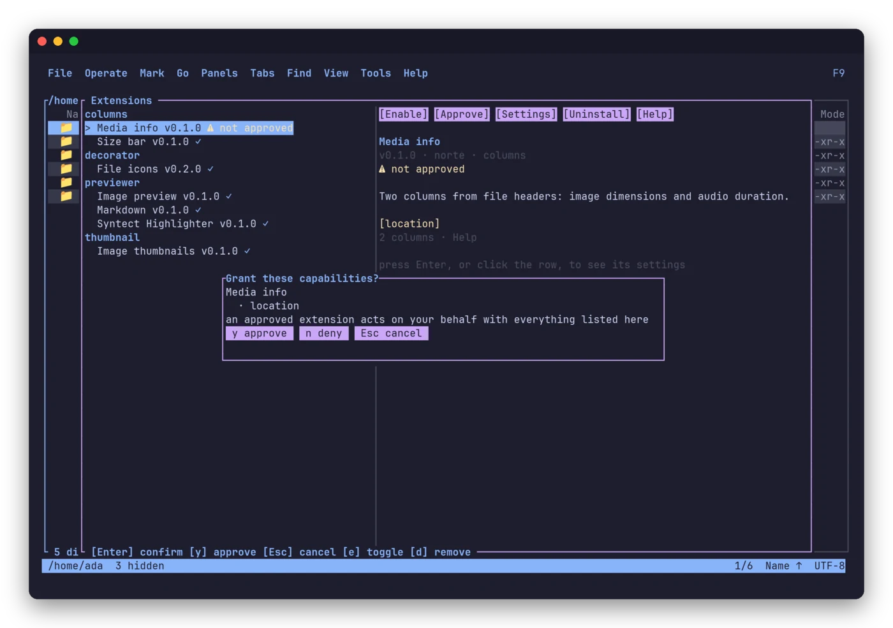
<p><b>Installing is not consenting.</b> A plugin arrives unapproved and
asks for each capability it needs. Replace its binary and the approval is
withdrawn.</p>
</td>
<td width="50%" valign="top">
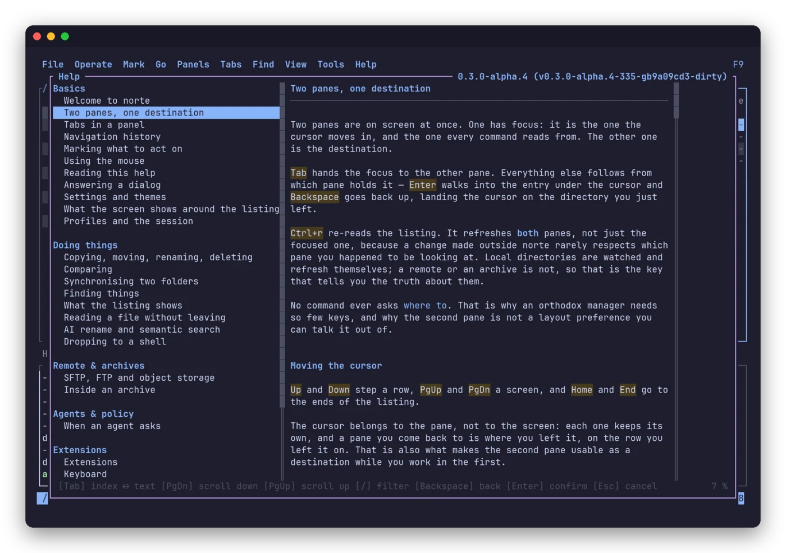
<p><b>A manual that knows your keys.</b> The help is written for your
preset and your language — English and Spanish — and every plugin brings
its own page.</p>
</td>
</tr>
</table>

<details>
<summary><b>More: compare & sync, search index, AI rename, disk map, cd-on-quit…</b></summary>
<br>

- **Compare and sync** two trees, locally or across hosts. `norte compare`
  and `norte sync` answer in the exit code, so they script cleanly; sync
  always shows its plan and asks before applying.
- **A search index** over any tree: `norte index build` / `norte index query`.
- **AI suggestions, opt-in.** `norte ai` produces a *reviewable* plan
  (e.g. a batch rename) that you confirm before anything moves.
- **Disk map**, tree view, details pane, bookmarks, history and a quick
  go-to that decodes each suggestion with the pane's own encoding.
- **Shell integration**: add `eval "$(norte shell-init bash)"` to your rc
  file and quitting norte leaves your shell where you were.
- **Bring your VS Code theme**: `norte theme import`.
- **`norte doctor`** and **`norte paths`** tell you what is loaded and where
  every file lives.

</details>

### Themes

Ten built-in themes, live-switchable, in the terminal and the window alike —
or import one from VS Code.

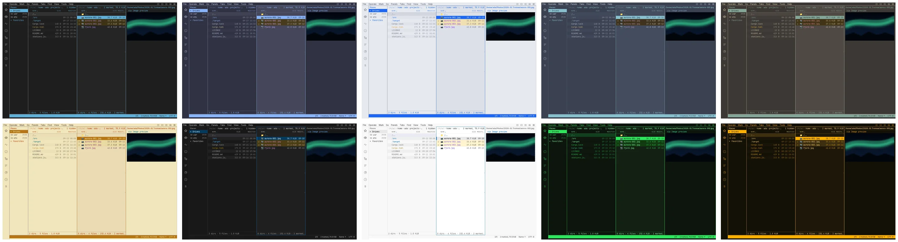

### The same program, in a window

<table>
<tr>
<td width="50%">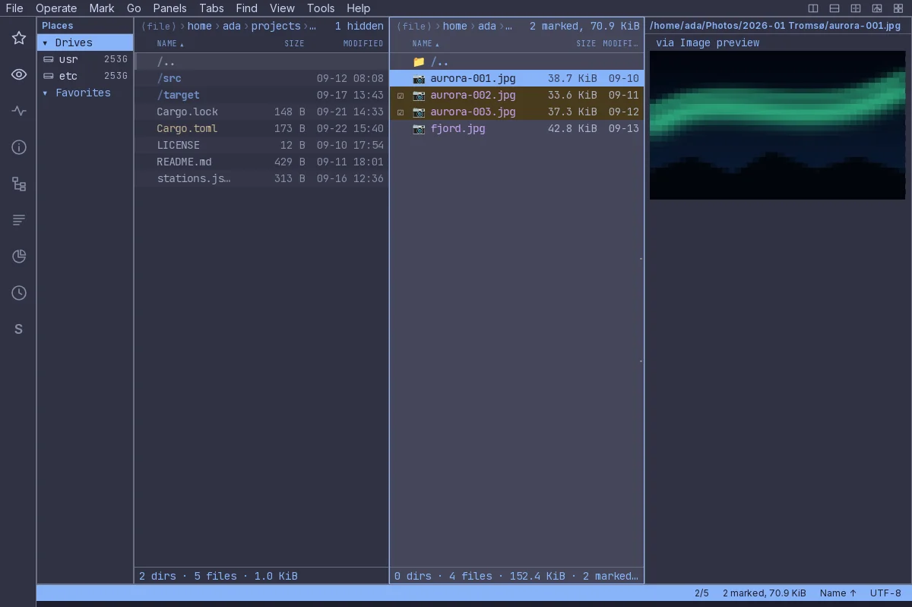</td>
<td width="50%">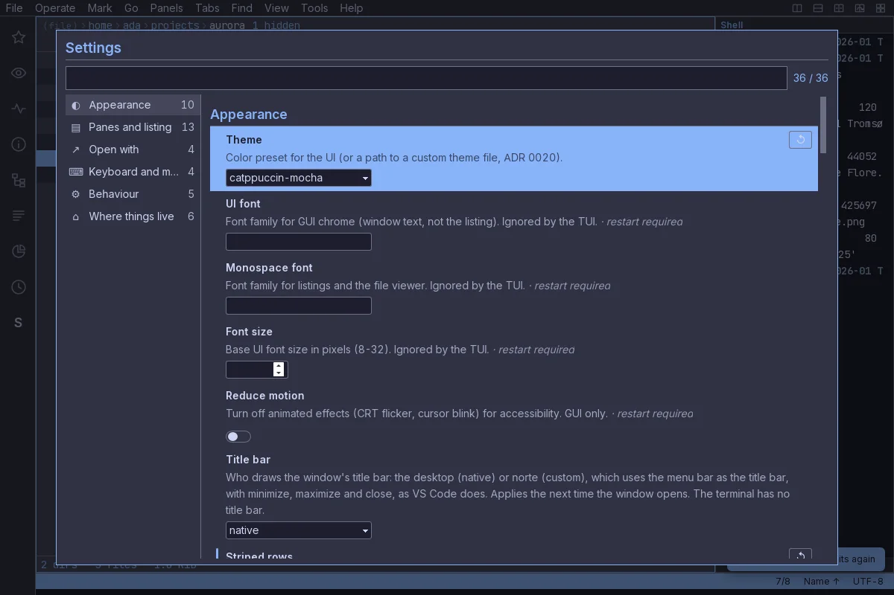</td>
</tr>
</table>

`norte-gui` is a native Tauri window over the same core. It ships as `.deb`,
`.rpm` or AppImage and brings the `norte` and `ntc` binaries with it, so a
clean install has a daemon to talk to.

## Install

> [!NOTE]
> **Alpha.** The current release, **v0.3.0-alpha.4**, ships **x86_64 Linux**
> binaries. macOS and Windows are configured targets and build from source
> today. Interfaces and configuration may still change.

Two binaries, each with its own installer — `ntc`, the file manager, and
`norte`, the command line (daemon, connections, policy, undo, index, doctor):

```sh
curl --proto '=https' --tlsv1.2 -LsSf \
  https://github.com/compilando/norte/releases/latest/download/norte-tui-installer.sh | sh
curl --proto '=https' --tlsv1.2 -LsSf \
  https://github.com/compilando/norte/releases/latest/download/norte-cli-installer.sh | sh
```

<details>
<summary><b>From source</b></summary>
<br>

`make setup` prepares a fresh machine, even one without Rust or `just`. Then:

```sh
cargo install --path crates/norte-cli --locked   # the `norte` command
cargo install --path crates/norte-tui --locked   # the `ntc` file manager
```

</details>

<details>
<summary><b>The window (<code>norte-gui</code>)</b></summary>
<br>

Grab the `.deb`, `.rpm` or AppImage from the
[releases](https://github.com/compilando/norte/releases), or build it — this
needs the system's WebKitGTK, GTK3 and libsoup3 development packages:

```sh
cargo install --path crates/norte-gui-tauri --locked
```

The window is a supported frontend with its own gate (`just gui-ci`). It is
not yet exercised against screen readers, IME input or fractional scaling
(#261), and the packages target a current glibc/WebKitGTK. The TUI remains
the frontend with the most surface.

</details>

## Quick start

```sh
norte tui                 # the file manager, in the current directory
norte tui ~/code          # ...somewhere else
norte tui --preset vim    # ...with your keys: orthodox, vim, cua, krusader,
                          #    far, norton or total-commander
```

`norte tui` hands over to `ntc`, which you can also run directly. It embeds
the core, so there is nothing to start first. The `norte` command is the
scriptable side:

```sh
norte ls ~/code                                         # ls, cp, mv, rm, mkdir, connect…
norte sync --mode update ~/photos /mnt/backup --dry-run # the plan, nothing touched
norte help keys                                         # the keys your preset really gives you
```

## Agents, governed, not trusted

Most tools hand an agent your shell and hope. norte gives it a **file
interface with a gatekeeper**.

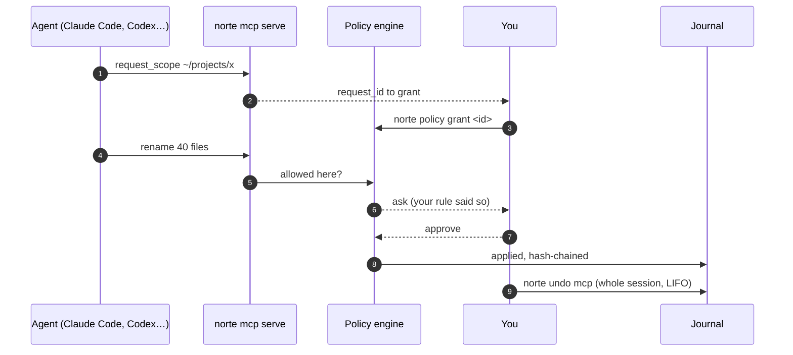

Hook it up in your agent's MCP config:

```json
{
  "mcpServers": {
    "norte": { "command": "norte", "args": ["mcp", "serve", "--session", "mcp"] }
  }
}
```

Then write the rules. First match wins; without a policy, an agent is
denied even inside a granted scope:

```toml
# policy.toml, in norte's config directory (`norte paths` shows where)
[[rule]]              # never let agents delete
op = "delete"
actor = "agent"
action = "deny"

[[rule]]              # nothing over SFTP
scheme = "sftp"
actor = "agent"
action = "deny"

[[rule]]              # everything else: ask me
action = "ask"
```

`norte audit` verifies the journal's hash chain and exports it. See
[`docs/policy-example.toml`](docs/policy-example.toml) for every knob.

## Plugins

Plugins are **WASM components** (`wasm32-wasip2`) that run sandboxed, with
only the capabilities you approve. The official ones:

| Plugin | Kind | What it does |
| --- | --- | --- |
| `git-status` | columns | Which files changed against the index |
| `file-icons` | decorator | An icon per entry: emoji, ASCII or Nerd Font |
| `media-info` | columns | Image dimensions and audio duration, from the header only |
| `size-bar` | columns | Each file's size as a `█░` bar |
| `age` | columns | How long ago it changed: `3h`, `2d`, `5mo` |
| `markdown` | previewer | Markdown rendered as styled lines |
| `image-ansi` | previewer | Images as half-block cells in the terminal |
| `image-thumb` | thumbnail | Verified thumbnails for the window's viewer |
| `syntect` | previewer | Syntax highlighting for the viewer |
| `date-prefix` | renamer | Proposes `YYYY-MM-DD_name`, reviewed before it runs |
| `rename-log` | hook | Keeps a `.norte-renames.log` of every rename |

```sh
just plugins                        # build and install them all
norte plugin install <dir>          # install one — it arrives unapproved
norte plugin list                   # id, kind, approved, enabled, capabilities
```

A `provider` plugin can even serve a new URL scheme, such as `webdav://`.
Start from [`plugins/template/`](plugins/template/) and the
[plugin author guide](docs/plugins.md).

## Architecture

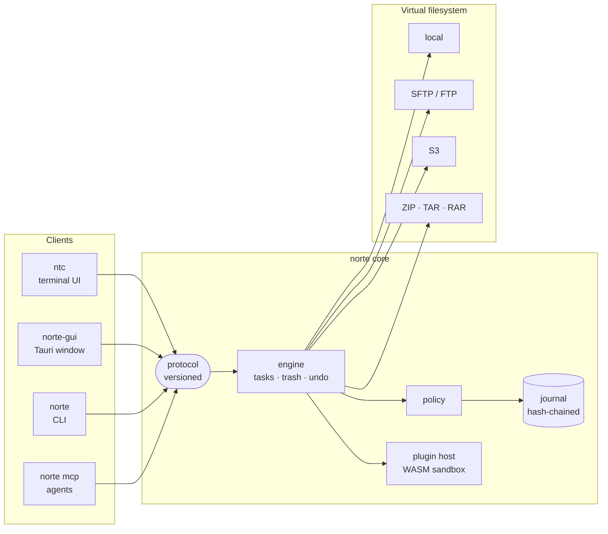

The core runs embedded in any client or as a daemon over a Unix socket.
Deep dives: [ARCHITECTURE.md](ARCHITECTURE.md), the
[specification](docs/spec/norte-spec.md) and
[155 architecture decisions](docs/adr/README.md).

## Roadmap

- [x] Two-pane TUI with seven keymap presets
- [x] SFTP, FTP, S3 and archives through one VFS
- [x] MCP bridge with scopes, policy, journal and undo
- [x] WASM plugin system with per-capability consent
- [x] `norte-gui`, a native window over the same core
- [ ] Releases built in CI for macOS and Windows
- [ ] Accessibility: screen readers, IME, fractional scaling (#261)
- [ ] Plugin signing and a registry

See the [changelog](CHANGELOG.md) for what landed in each alpha.

## Contributing

Issues and pull requests are welcome — start with
[CONTRIBUTING.md](CONTRIBUTING.md) and the [Code of Conduct](CODE_OF_CONDUCT.md).

```sh
make setup   # a fresh machine, with or without Rust or just
just ci      # format, lint, tests and docs — the gate before merging
just test    # the test suite, with cargo-nextest
make dev     # a debug build of the TUI
just hooks   # install the pre-push hook
```

The gates run **locally** — GitHub Actions is disabled on this repository —
so install the hook. The toolchain is pinned in `rust-toolchain.toml`; the
MSRV is stable minus two (currently 1.94).

Found a vulnerability? Please follow [SECURITY.md](SECURITY.md) instead of
opening an issue.

## License

norte follows the same split as Zed. The **protocol, VFS providers, test kit
and plugin SDK** are **MIT or Apache-2.0**, so anyone can build clients,
providers and plugins on them. The **core and official frontends** are
**AGPL-3.0-only**. Each crate carries its own license files.

## Telemetry

None. Not even opt-in. Diagnostics stay on your machine.

<br>

<div align="center">
  <a href="https://getnorte.dev"><b>getnorte.dev</b></a>
  <br>
  <sub>Built in Rust. No telemetry. Ever.</sub>
</div>
